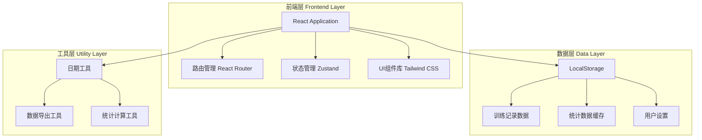

# 无下肢五分化健身打卡记录网站 - 技术架构文档

## 1. 架构设计



## 2. 技术栈说明

### 2.1 前端技术栈
- **框架**: React 18 + TypeScript
- **构建工具**: Vite
- **样式方案**: Tailwind CSS 3
- **路由管理**: React Router DOM v6
- **状态管理**: Zustand
- **图表库**: Recharts
- **图标库**: Lucide React
- **日期处理**: date-fns
- **数据导出**: xlsx (SheetJS)

### 2.2 项目结构
```
fitness-tracker/
├── src/
│   ├── components/          # 可复用组件
│   │   ├── ui/            # 基础UI组件
│   │   ├── calendar/       # 日历组件
│   │   ├── exercise/      # 训练相关组件
│   │   └── charts/         # 图表组件
│   ├── pages/             # 页面组件
│   │   ├── Home.tsx       # 首页
│   │   ├── Workout.tsx    # 训练打卡页
│   │   ├── History.tsx    # 历史记录页
│   │   ├── Stats.tsx      # 数据复盘页
│   │   └── Settings.tsx   # 设置页
│   ├── hooks/             # 自定义Hooks
│   ├── utils/             # 工具函数
│   ├── store/             # Zustand状态管理
│   ├── data/              # 固定训练计划数据
│   ├── types/             # TypeScript类型定义
│   └── App.tsx            # 应用入口
├── public/                # 静态资源
└── package.json
```

## 3. 路由定义

| 路由 | 页面 | 说明 |
|-----|------|------|
| `/` | Home | 首页，显示训练日历和本周进度 |
| `/workout/:date?` | Workout | 训练打卡页，date参数可选，默认今日 |
| `/history` | History | 历史记录页，查看过往训练 |
| `/stats` | Stats | 数据复盘页，统计和图表 |
| `/settings` | Settings | 设置页，个人设置和数据管理 |

## 4. 数据模型定义

### 4.1 训练计划数据
```typescript
// src/types/training.ts

export type DayType = 'chest' | 'back' | 'shoulders' | 'arms' | 'core' | 'rest';

export interface Exercise {
  id: string;
  name: string;
  sets: number;
  reps: number;
  videoUrl?: string;
  muscleGroup: string;
}

export interface TrainingDay {
  day: number;
  type: DayType;
  name: string;
  exercises: Exercise[];
  restTime: number; // 推荐组间休息时长（秒）
}
```

### 4.2 训练记录数据
```typescript
// src/types/workout.ts

export type SetStatus = 'normal' | 'failure' | 'exhausted' | 'good_form';

export interface SetRecord {
  setNumber: number;
  weight: number;
  actualReps: number;
  restTime: number;
  status: SetStatus;
  note?: string;
}

export interface ExerciseRecord {
  exerciseId: string;
  exerciseName: string;
  sets: SetRecord[];
}

export interface WorkoutNotes {
  bodyCondition: number;
  sleepQuality?: string;
  feeling?: string;
  supplements?: string;
  diet?: string;
  injury?: string;
  warmup?: boolean;
  stretching?: boolean;
}

export interface WorkoutRecord {
  id: string;
  date: string;
  dayType: DayType;
  exercises: ExerciseRecord[];
  notes: WorkoutNotes;
  duration: number;
  completedAt?: string;
}
```

### 4.3 统计数据
```typescript
// src/types/stats.ts

export interface ProgressPoint {
  date: string;
  exerciseId: string;
  avgWeight: number;
}

export interface PersonalBest {
  exerciseId: string;
  exerciseName: string;
  weight: number;
  date: string;
}

export interface WorkoutStats {
  totalWorkouts: number;
  weeklyCompletion: number;
  monthlyCompletion: number;
  personalBests: PersonalBest[];
  progressData: ProgressPoint[];
  weakAreas: string[];
}
```

### 4.4 用户设置
```typescript
// src/types/settings.ts

export interface UserSettings {
  restTime: number; // 默认组间休息时长（秒）
  enableNotifications: boolean;
  notificationTime?: string;
  theme: 'dark' | 'light';
}
```

## 5. 状态管理设计

### 5.1 Zustand Store结构
```typescript
// src/store/workoutStore.ts

interface WorkoutStore {
  // 状态
  currentWorkout: WorkoutRecord | null;
  workoutHistory: WorkoutRecord[];
  settings: UserSettings;
  
  // 操作
  startWorkout: (date: string, dayType: DayType) => void;
  updateSet: (exerciseId: string, setNumber: number, setData: Partial<SetRecord>) => void;
  completeWorkout: () => void;
  loadHistory: () => void;
  updateSettings: (settings: Partial<UserSettings>) => void;
  clearAllData: () => void;
  exportData: () => void;
}
```

## 6. 核心功能实现

### 6.1 数据持久化
- 使用LocalStorage存储所有训练数据
- 数据键名前缀：`fitness_tracker_`
- 自动保存机制：每次数据变更自动保存
- 数据结构：JSON格式存储

### 6.2 训练计划管理
```typescript
// src/data/trainingPlan.ts

export const TRAINING_PLAN: TrainingDay[] = [
  {
    day: 1,
    type: 'chest',
    name: '胸部日',
    restTime: 90,
    exercises: [
      { id: 'chest_1', name: '平板哑铃卧推', sets: 4, reps: 12, muscleGroup: '胸大肌' },
      { id: 'chest_2', name: '上斜器械推胸', sets: 4, reps: 12, muscleGroup: '上胸' },
      { id: 'chest_3', name: '绳索夹胸', sets: 4, reps: 12, muscleGroup: '胸大肌' },
      { id: 'chest_4', name: '胸式双杠臂屈伸', sets: 4, reps: 12, muscleGroup: '下胸' }
    ]
  },
  // ... 其他训练日
];
```

### 6.3 统计计算逻辑
```typescript
// src/utils/statsCalculator.ts

export function calculateStats(records: WorkoutRecord[]): WorkoutStats {
  // 计算总训练次数
  const totalWorkouts = records.length;
  
  // 计算本周完成率
  const weeklyCompletion = calculateWeeklyCompletion(records);
  
  // 计算各动作PB
  const personalBests = calculatePersonalBests(records);
  
  // 计算力量提升数据
  const progressData = calculateProgress(records);
  
  // 分析薄弱部位
  const weakAreas = analyzeWeakAreas(records);
  
  return { totalWorkouts, weeklyCompletion, monthlyCompletion, personalBests, progressData, weakAreas };
}
```

### 6.4 数据导出功能
```typescript
// src/utils/exportData.ts

import * as XLSX from 'xlsx';

export function exportToExcel(records: WorkoutRecord[]) {
  const worksheet = XLSX.utils.json_to_sheet(
    records.flatMap(record => 
      record.exercises.flatMap(exercise =>
        exercise.sets.map(set => ({
          日期: record.date,
          训练部位: record.dayType,
          动作名称: exercise.exerciseName,
          组数: set.setNumber,
          重量: set.weight,
          次数: set.actualReps,
          休息时长: set.restTime,
          状态: set.status,
          备注: set.note || ''
        }))
      )
    )
  );
  
  const workbook = XLSX.utils.book_new();
  XLSX.utils.book_append_sheet(workbook, worksheet, '训练记录');
  XLSX.writeFile(workbook, `健身记录_${new Date().toISOString().split('T')[0]}.xlsx`);
}
```

## 7. UI组件设计

### 7.1 核心组件列表

| 组件名称 | 功能描述 | 所在页面 |
|---------|---------|---------|
| Calendar | 月度日历视图，标注训练部位 | 首页 |
| WeekProgress | 本周训练进度条 | 首页 |
| ExerciseCard | 单个动作卡片，包含4组数据录入 | 训练打卡页 |
| SetInput | 单组数据录入表单 | 训练打卡页 |
| Timer | 组间休息计时器 | 训练打卡页 |
| WorkoutNotes | 每日备注表单 | 训练打卡页 |
| HistoryList | 历史记录列表 | 历史记录页 |
| ProgressChart | 力量提升折线图 | 数据复盘页 |
| StatsCard | 统计数据卡片 | 数据复盘页 |
| SettingsItem | 设置项组件 | 设置页 |

### 7.2 响应式设计断点
```css
/* Tailwind CSS默认断点 */
sm: 640px   /* 小屏手机 */
md: 768px   /* 平板 */
lg: 1024px  /* 桌面 */
xl: 1280px  /* 大屏桌面 */
```

## 8. 性能优化策略

### 8.1 代码分割
- 使用React.lazy懒加载页面组件
- 图表库按需加载

### 8.2 数据缓存
- LocalStorage缓存训练数据
- 统计数据计算后缓存

### 8.3 渲染优化
- 使用React.memo优化组件渲染
- 使用useMemo缓存计算结果
- 虚拟列表优化长列表渲染

## 9. 开发规范

### 9.1 代码规范
- 使用TypeScript严格模式
- 遵循ESLint和Prettier配置
- 组件文件使用PascalCase命名
- 工具函数使用camelCase命名

### 9.2 Git提交规范
- feat: 新功能
- fix: 修复bug
- docs: 文档更新
- style: 代码格式调整
- refactor: 重构
- test: 测试相关
- chore: 构建/工具相关

## 10. 部署方案

### 10.1 构建命令
```bash
npm run build
```

### 10.2 部署平台
- **推荐**: Vercel、Netlify、GitHub Pages
- **特点**: 静态网站，无需服务器，CDN加速

### 10.3 PWA支持（可选）
- 添加manifest.json
- 注册Service Worker
- 支持离线访问
- 可安装到桌面